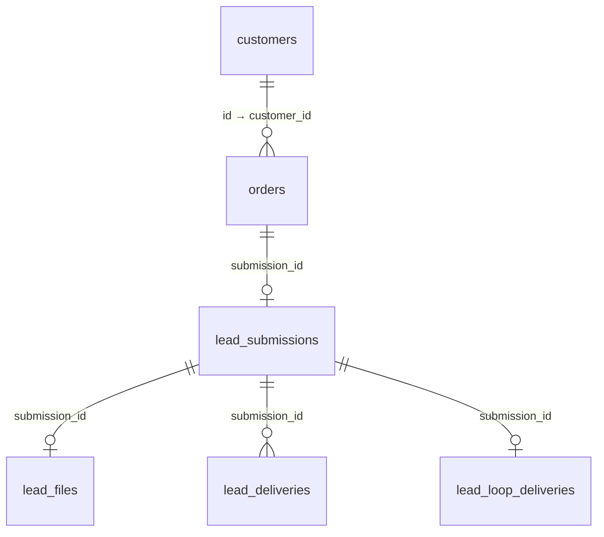

# База данных Needle Shark

Актуализировано 22 сентября 2026 года. Рабочая база — `needle_shark`, схема `public`, PostgreSQL 16.15. Структура **6 таблиц и 58 колонок**, ограничения, индексы и последовательности сверены с VPS запросами только для чтения. Код обработки и очистки сверен с установленными файлами по SHA-256. Результаты: [отчёт проверки](verification/20260922-database-documentation.json).

Позднее в тот же день установлен вывод `orders.id` в письмах и LOOP и дополнено объяснение пропусков клиентских номеров. Схема не менялась; новая проверка кода и доставки — [отчёт обновления уведомлений](verification/20260922-notification-order-id.json).

«Заказ» (`orders`) здесь означает входящую заявку с сайта, а не подтверждённую покупку. Учёта оплаты, отгрузки и остатков в этой БД нет. Товары сайта описываются в `catalog/products.json`.

## Карта таблиц

| Таблица | Назначение одной строки |
| --- | --- |
| `customers` | Карточка клиента, объединяющая обращения по нормализованному контакту |
| `orders` | Одно новое обращение с сайта |
| `lead_submissions` | Данные одной принятой заявки для защиты от повторов и доставки |
| `lead_files` | Один закрытый файл заявки; после очистки строки может не быть |
| `lead_deliveries` | Одно почтовое уведомление одному настроенному получателю |
| `lead_loop_deliveries` | Одно уведомление о заявке в настроенный канал LOOP |



У исторических заявок времён Google может не быть `lead_submissions` и связанных строк. Новая заявка получает реестр, файл при наличии и задания доставки в одной транзакции. LOOP-задание создаётся при включённой интеграции; исторические заявки автоматически в неё не добавляются.

## Какие бывают ID

| Поле | Кто выдаёт | Назначение |
| --- | --- | --- |
| `customers.id` | PostgreSQL, собственный счётчик | Постоянный номер карточки клиента |
| `orders.id` | PostgreSQL, другой счётчик | Постоянный числовой номер заявки |
| `orders.customer_id` | Обработчик берёт `customers.id` | Ссылка на клиента, которому принадлежит заявка |
| `orders.submission_id` | Браузер, `crypto.randomUUID()`; сервер проверяет UUID | Узнать повторную отправку и связать заявку с файлами/доставкой |
| `submission_id` в остальных четырёх таблицах | Копируется UUID заявки | Связи между таблицами, а не новые номера |
| `lead_deliveries.id`, `lead_loop_deliveries.id` | PostgreSQL, отдельный счётчик каждой таблицы | Номер задания доставки, а не заявки или клиента |
| `lease_token` в обеих очередях | Сервер, новый UUID при захвате задания | Разрешает завершить именно текущую попытку доставки |

Колонки с буквальным именем `orders_id` нет: номер заявки — `orders.id`. У `orders.customer_id` нет своего счётчика: он **должен совпадать с `customers.id` нужного клиента**. Иначе связь заявки с клиентом потеряет смысл.

### Почему номер клиента иногда совпадает с номером заявки

У клиентов и заявок отдельные последовательности: `public.customers_id_seq` и `public.orders_id_seq`. Каждая начинается с 1, шаг — 1, зацикливание выключено. Но объяснять совпадения только одинаковым стартом недостаточно: **текущий обработчик расходует значение счётчика клиентов на каждую новую заявку**, включая обращения существующего клиента. Поэтому при успешных вставках оба счётчика продвигаются вместе, а новый клиент часто получает номер своей первой заявки. В `customers` при этом остаются пропуски. SQL-связи между самими счётчиками нет.

Условный пример, не данные покупателей:

| Событие | `orders.id` | `orders.customer_id` | Что произошло с клиентом |
| --- | --- | --- | --- |
| Первое обращение контакта А | 1 | 1 | Создан клиент 1 |
| Первое обращение контакта Б | 2 | 2 | Создан клиент 2 |
| Новое обращение контакта А | 3 | 1 | Использован прежний клиент 1 |

На рабочей БД 22 сентября подтверждено: не все `orders.id` равны `orders.customer_id`, есть клиенты с несколькими заявками. Проверка выполнена агрегатами без выгрузки имён, контактов и содержимого обращений.

**Порядок выдачи и отсутствие пропусков — разные требования.** Счётчики выдают возрастающие числа, но не гарантируют сплошную нумерацию сохранённых строк. Пропуски возможны после отката транзакции, конфликта вставки или удаления. В `crm.py` клиент сохраняется через `INSERT … ON CONFLICT(contact_key) DO UPDATE`: новое обращение существующего клиента тоже может израсходовать очередное значение `customers_id_seq`, хотя новая карточка не появится. Повтор уже принятого UUID отсекается раньше этой вставки. Для хронологии используйте `created_at` и явный `ORDER BY`, а не порядок строк в DBeaver. Перенумерация записей и сброс счётчиков не требуются.

Механизм воспроизведён 22 сентября в одноразовой тестовой схеме реальным `crm.archive`: четыре обращения контакта А создают клиента 1 и расходуют 2–4; три обращения контакта Б создают клиента 5 и расходуют 6–7; два обращения В создают клиента 8 и расходуют 9; обращение Г создаёт клиента 10. Итог — десять заявок и клиенты `1, 5, 8, 10`, без удалений и ошибок транзакций. Это синтетическое воспроизведение причины; полная история расходования каждого пропущенного номера рабочей БД не восстановлена. Код регистрации клиентов в изменении формата уведомлений не менялся.

### Зачем нужен длинный `submission_id`

UUID создаётся **до первого запроса к серверу**, когда `orders.id` ещё неизвестен браузеру. Если ответ потерялся, форма повторяет отправку с тем же UUID. Сервер сравнивает постоянный отпечаток содержимого:

- новая заявка — сохраняет всё одной транзакцией, отвечает `202`;
- тот же UUID и содержимое — отвечает `200`, не создавая новую заявку и задания доставки;
- тот же UUID с другим содержимым — отвечает `409`;
- исторический UUID без постоянного отпечатка — также `409`, без повторной рассылки.

В запросе и ответе API UUID называется `id`, в БД — `submission_id`: это одно значение. UUID не является паролем или разрешением на доступ. Он сохраняется в техническом заголовке письма `Message-ID`, но не используется как видимый номер заявки в новом формате уведомлений.

### Человекочитаемый номер

По указанию владельца уведомления используют обычный **`orders.id`**, без префикса: тема письма — **«Needle Shark — заявка №42»**, строка в письме и LOOP — **«Номер заявки: 42»**. Отдельная колонка и счётчик не нужны. UUID остаётся техническим ключом API, повторов, связей и заголовка `Message-ID`.

Пример просмотра в DBeaver, только чтение:

```sql
SELECT id AS order_id,
       customer_id,
       submission_id,
       created_at
FROM public.orders
ORDER BY id DESC
LIMIT 100;
```

Запрос читает номера, не меняя БД. Перед отправкой `delivery_store.claim()` соединяет `lead_submissions` с `orders` по UUID и добавляет в рабочую копию данных `order_id`. Это поддерживает и задания, сохранённые прежней версией. В БД `payload` и отпечаток не переписываются, старые отправленные сообщения не переотправляются. Просто заменить UUID числом в форме нельзя: API проверяет формат, ключ используется в нескольких таблицах. Состояние установки новой версии фиксируется в [контексте проекта](PROJECT_CONTEXT.md).

## Как читать словарь

`PK` — первичный ключ; `FK` — ссылка на другую таблицу; `UNIQUE` — запрет дублей; `IDENTITY` — число выдаёт PostgreSQL. В графе «NULL» указано, разрешено ли отсутствие значения в БД. `NULL` отличается от пустой строки. Если default не указан, значения по умолчанию нет; необязательная колонка без значения получает `NULL`.

Все даты — `TIMESTAMPTZ`: момент времени, который DBeaver может показывать в часовом поясе сеанса. В JSON время записывается строкой UTC. Длины текста и часть допустимых значений проверяет API, а не SQL; ручное редактирование может обойти эти проверки.

## `customers` — карточки клиентов

| Колонка | Тип | NULL | Назначение и правила |
| --- | --- | --- | --- |
| `id` | `BIGINT` | Нет | PK, `GENERATED ALWAYS AS IDENTITY`; независимый номер клиента |
| `name` | `TEXT` | Нет | Имя при создании карточки; повторная заявка его не заменяет. API: до 120 символов |
| `contact` | `TEXT` | Нет | Телефон/email при создании карточки, без пробелов по краям; автоматически не обновляется. API: до 254 символов |
| `contact_key` | `TEXT` | Нет | UNIQUE. Ключ объединения: email через `casefold()`, у телефона остаются только цифры |
| `first_inquiry_at` | `TIMESTAMPTZ` | Нет | Время заявки, создавшей карточку; при повторе не пересчитывается |
| `last_inquiry_at` | `TIMESTAMPTZ` | Нет | Последнее обращение; обновляется через `GREATEST` прежнего и нового времени |
| `created_at` | `TIMESTAMPTZ` | Нет | Время создания строки карточки; default `now()` |
| `notes` | `TEXT` | Нет | Внутренние заметки о клиенте; default `''`. Форма и доставка их не используют |

Email и телефон одного человека между собой не объединяются. Начальные 8 и +7 не приводятся к единому международному виду. Общий телефон может объединить разных людей; разные контакты человека — создать разные карточки. Это группировка по контакту, не проверка личности. При историческом импорте не по порядку `first_inquiry_at` не обязан быть минимальным временем всех заявок.

## `orders` — входящие заявки

| Колонка | Тип | NULL | Назначение и правила |
| --- | --- | --- | --- |
| `id` | `BIGINT` | Нет | PK, `GENERATED ALWAYS AS IDENTITY`; самостоятельный номер заявки |
| `submission_id` | `UUID` | Нет | UNIQUE. Технический ключ повторной отправки и связи с `lead_submissions` |
| `customer_id` | `BIGINT` | Нет | FK → `customers.id`; несколько заявок могут ссылаться на одного клиента |
| `created_at` | `TIMESTAMPTZ` | Нет | Время приёма от сервера, не браузера; при историческом импорте — сохранённое время обращения |
| `customer_name` | `TEXT` | Нет | Имя из конкретной заявки; снимок независимо от карточки клиента |
| `contact` | `TEXT` | Нет | Контакт конкретной заявки, отдельно от `customers.contact` |
| `description` | `TEXT` | Нет | Исходный текст задачи без крайних пробелов; API: до 5000 символов. Обработчик не дописывает сюда структурированные поля |
| `status` | `TEXT` | Нет | Статус работы с заявкой; default `new`. Обработчик его не меняет; SQL-справочника/`CHECK` нет. Это не статус уведомления |
| `attachment_name` | `TEXT` | Да | Имя файла; API: до 160 символов, разделители пути заменяются `_`. Остаётся после очистки файла |
| `consent` | `BOOLEAN` | Нет | Согласие при отправке; API принимает только `true`, SQL сам по себе не запрещает `false` |
| `consent_documents` | `JSONB` | Нет | Массив URL соглашения/политики при отправке; default `[]`. Не копии и не хеши редакций документов |
| `notes` | `TEXT` | Нет | Внутренние заметки по заявке; default `''`. Форма и доставка их не используют |
| `product_slug` | `TEXT` | Да | Код товара, например `chehol-na-kvadrocikl`; API: до 100 символов, строчная латиница/цифры/дефисы. Не FK на таблицу товаров |
| `product_name` | `TEXT` | Да | Название товара при обращении; API: до 200 символов. Передаётся вместе с `product_slug` |
| `product_size` | `TEXT` | Да | Д × Ш × В в см; API: до 60 символов, три положительных целых через ` × `, нужен товар. Размеры вида R17 и комплектация могут идти в тексте |
| `inquiry_type` | `TEXT` | Да | `direct` — напрямую, `sizing` — подбор размера, `wholesale` — партия для бизнеса. Проверяет API; SQL `CHECK` нет |
| `quantity` | `INTEGER` | Да | Количество изделий; SQL и API: 1–1 000 000. Для комплектов колёс — итоговое число чехлов; число комплектов указывается в тексте |
| `source_path` | `TEXT` | Да | Путь страницы формы: `/`, `/business/`, `/catalog/.../`; API: до 200 символов, без query/фрагмента. Не рекламный источник и не UTM |
| `business_intent` | `TEXT` | Да | `ready` — готовые изделия, `custom` — изделие на заказ, `materials` — ткани/стропы. Проверяют SQL и API |
| `business_company` | `TEXT` | Да | Необязательная компания/сфера; API: до 160 символов |
| `attachment_url` | `TEXT` | Да | Историческая закрытая ссылка Drive. Текущий обработчик не создаёт, у новых заявок `NULL`; не ссылка на `lead_files` |

Товарные сведения описывают запрос, не подтверждают цену, наличие или покупку. API проверяет синтаксис email либо телефон из разрешённых символов с 7–15 цифрами. Доступность почты/принадлежность телефона не проверяются.

## `lead_submissions` — данные отправки и защита от дублей

| Колонка | Тип | NULL | Назначение и правила |
| --- | --- | --- | --- |
| `submission_id` | `UUID` | Нет | PK и FK → `orders.submission_id`; максимум одна строка на заявку |
| `fingerprint` | `TEXT` | Нет | SHA-256 нормализованного входного JSON с упорядоченными ключами, включая согласие, контекст и base64 файла. Сравнивает повторы; время приёма не входит |
| `payload` | `JSONB` | Нет | Снимок данных для уведомлений со временем сервера. Байтов/base64 файла нет, только его имя и MIME при наличии |
| `ip_hash` | `TEXT` | Нет | HMAC-SHA-256 IP с серверным `IP_HASH_SECRET` для ограничения частоты; исходный IP здесь не сохраняется |
| `created_at` | `TIMESTAMPTZ` | Нет | Время создания строки; default `now()`. Используется ограничителем частоты и очисткой файлов |

`payload` формирует приложение; SQL не проверяет отдельные JSON-ключи:

| Ключ JSON | Значение |
| --- | --- |
| `id` | Тот же UUID, что `submission_id` |
| `name`, `contact`, `question` | Имя, контакт, исходный текст посетителя |
| `consent`, `consent_documents` | Принятое согласие и URL документов |
| `created_at` | Время приёма от сервера, строка ISO 8601 в UTC |
| `product_slug`, `product_name`, `product_size`, `inquiry_type`, `quantity`, `source_path`, `business_intent`, `business_company` | Необязательные поля с тем же смыслом, что в `orders`; отсутствующие ключи могут не сохраняться |
| `attachment` | Необязательный объект `name`/`type`; содержимое файла — только в `lead_files.content` |

`payload` и `orders` намеренно пересекаются: реестр удобен для работы с заявками, снимок — для фоновой доставки. Это одна заявка. Ручное изменение `orders` не меняет `payload`; письмо и LOOP формируются из снимка. Отпечаток остаётся после удаления файла и продолжает защищать от повторов.

Ограничитель принимает не более 10 новых заявок за час на один HMAC IP и не более 500 уникальных заявок с незавершёнными почтовыми заданиями. LOOP в этот порог не включён. UTM, referrer и отдельный ID кнопки в БД не сохраняются.

## `lead_files` — закрытые файлы

| Колонка | Тип | NULL | Назначение и правила |
| --- | --- | --- | --- |
| `submission_id` | `UUID` | Нет | PK и FK → `lead_submissions.submission_id`; максимум один файл на заявку |
| `name` | `TEXT` | Нет | Имя вложения для письма; также сохраняется в метаданных заявки |
| `mime_type` | `TEXT` | Нет | SQL `CHECK`: `application/pdf`, `image/png`, `image/jpeg` |
| `content` | `BYTEA` | Нет | Байты файла; SQL `CHECK`: 1–2 097 152 байт (2 МиБ). API дополнительно проверяет сигнатуру формата |

Публичной ссылки и HTTP-метода скачивания нет. Файлы читает почтовый обработчик; администратор может получить их через закрытую БД. LOOP не загружает байты и не передаёт имена/ссылки файлов.

Очистка удаляет **всю строку `lead_files`**, если прошло более 30 дней от `lead_submissions.created_at`, есть хотя бы одно почтовое задание и все почтовые задания заявки имеют `status='sent'` и непустое `sent_at`. Статус LOOP на очистку не влияет. При недоставленной/частично доставленной почте файл остаётся. `orders.attachment_name` и `payload.attachment` сохраняются: имя в истории не доказывает наличие байтов. Очистка не удаляет копии из писем, Google и резервных дампов.

## `lead_deliveries` — почтовая очередь

| Колонка | Тип | NULL | Назначение и правила |
| --- | --- | --- | --- |
| `id` | `BIGINT` | Нет | PK, `GENERATED ALWAYS AS IDENTITY`; номер почтового задания |
| `submission_id` | `UUID` | Нет | FK → `lead_submissions.submission_id`; у заявки может быть несколько получателей |
| `channel` | `TEXT` | Нет | SQL `CHECK`: только `email`; LOOP в отдельной таблице |
| `recipient` | `TEXT` | Нет | Адрес настроенного получателя уведомления, не контакт посетителя; фиксируется при создании задания |
| `status` | `TEXT` | Нет | SQL `CHECK`: `pending`, `sending`, `sent`; default `pending` |
| `attempts` | `INTEGER` | Нет | Число захватов задания, включая успешный и повтор после сбоя; default `0` |
| `retry_at` | `TIMESTAMPTZ` | Нет | Когда можно взять ожидающее задание; default `now()`, при ошибке переносится |
| `lease_until` | `TIMESTAMPTZ` | Да | Срок текущего захвата на 5 минут; после завершения попытки очищается |
| `lease_token` | `UUID` | Да | UUID текущего захвата, защищает от завершения устаревшим обработчиком; затем очищается |
| `sent_at` | `TIMESTAMPTZ` | Да | Время сохранения приложением подтверждения приёма SMTP-сервером |
| `last_error` | `TEXT` | Да | Обезличенный код, например `smtp_535`/`tls_error`; после успеха `NULL`. Текст ответа провайдера не сохраняется |

`UNIQUE(submission_id, channel, recipient)` запрещает одинаковые задания. Изменение списка получателей в настройках не переписывает существующие задания. Внутренние заметки из `orders`/`customers` в письмо не подставляются.

## `lead_loop_deliveries` — очередь LOOP

| Колонка | Тип | NULL | Назначение и правила |
| --- | --- | --- | --- |
| `id` | `BIGINT` | Нет | PK, `GENERATED ALWAYS AS IDENTITY`; собственный номер задания LOOP |
| `submission_id` | `UUID` | Нет | UNIQUE и FK → `lead_submissions.submission_id`; максимум одно LOOP-задание на заявку |
| `status` | `TEXT` | Нет | SQL `CHECK`: `pending`, `sending`, `sent`; default `pending` |
| `attempts` | `INTEGER` | Нет | Число захватов задания, включая успешную попытку; default `0` |
| `retry_at` | `TIMESTAMPTZ` | Нет | Ближайшее разрешённое время попытки для ожидающего задания; default `now()` |
| `lease_until` | `TIMESTAMPTZ` | Да | Срок текущего захвата на 5 минут; после завершения попытки очищается |
| `lease_token` | `UUID` | Да | UUID текущего захвата, не UUID заявки; после завершения попытки очищается |
| `sent_at` | `TIMESTAMPTZ` | Да | Время сохранения подтверждения LOOP: HTTP 200 и тело `ok` |
| `last_error` | `TEXT` | Да | `loop_http_...`, `loop_network_error` или `loop_delivery_error`; после успеха `NULL` |

Здесь нет `recipient`/`channel`: используется один вебхук из закрытой серверной настройки. Его URL/секрет не записывается в БД. Смена настройки влияет на направление ещё не отправленных заданий; у почты получатель зафиксирован в строке.

### Общие правила очередей

`pending` — ожидает попытки; `sending` — взято обработчиком на ограниченное время; `sent` — сервис подтвердил приём. При ошибке задание возвращается в `pending`, задержка растёт от 60 секунд до 1 часа, предела числа попыток нет. После истечения захвата `sending` можно взять повторно. Почта и LOOP обрабатываются отдельно.

Успех API означает сохранение БД. `sent` почты означает приём SMTP-провайдером, не подтверждает входящие; `sent` LOOP означает ответ вебхука, не прочтение человеком. Если сервис принял сообщение, но подтверждение потерялось до записи статуса, повторная попытка может отправить уведомление ещё раз. Уникальность задания в БД не гарантирует единственность внешнего сообщения.

## Ключи, индексы и целостность

У всех FK стандартное поведение PostgreSQL `NO ACTION`, без каскадного удаления. Нельзя удалить клиента при существующих заявках или родительскую заявку при зависимых строках. Очистка удаляет только файлы; остальные записи текущий runtime по возрасту не удаляет.

PK и UNIQUE из словаря имеют уникальные B-tree индексы. Дополнительные индексы:

| Имя | Таблица / ключи | Назначение |
| --- | --- | --- |
| `orders_customer_date` | `orders(customer_id, created_at DESC)` | История обращений клиента |
| `orders_date` | `orders(created_at DESC)` | Заявки по времени |
| `lead_submissions_ip_date` | `lead_submissions(ip_hash, created_at)` | Ограничение частоты заявок |
| `lead_deliveries_pending` | `lead_deliveries(retry_at) WHERE status <> 'sent'` | Незавершённые почтовые задания |
| `lead_loop_deliveries_pending` | `lead_loop_deliveries(retry_at) WHERE status <> 'sent'` | Незавершённые LOOP-задания |

Четыре независимые последовательности: `customers_id_seq`, `orders_id_seq`, `lead_deliveries_id_seq`, `lead_loop_deliveries_id_seq`. При проверке их читали через системный каталог, **`nextval` и `setval` не вызывались**.

## Подключение и хранение

VPS: `194.87.99.98`. DBeaver подключается через SSH-туннель:

- PostgreSQL: Host `127.0.0.1`, Port `5432`, Database `needle_shark`, Username `needle_admin`.
- Пароль: локальный `server/database-access.key`, исключённый из Git; не вставлять в документы и команды с публичным выводом.
- SSH: Host `194.87.99.98`, Port `22`, User `needledeploy`, Public Key, файл `~/.ssh/needle_shark_ed25519`.
- Затем Test Connection. Прямой публичный доступ к SQL не требуется.

`needle_admin` имеет запрошенные владельцем права SUPERUSER. Приложение использует `needle_app`, без SUPERUSER, с SELECT/INSERT/UPDATE на шесть таблиц и доступом к нужным последовательностям. Пароль приложения, почта, ключ HMAC и LOOP-вебхук настроены в `/etc/needle-shark/leads.env`, не в Git. Роли и права таблиц сверены 22 сентября; сетевые правила в этой задаче не менялись и заново не проверялись.

Контакты, `payload`, файлы и адреса получателей — закрытые данные. Их нельзя помещать в Git, публичный каталог или аналитические события. HMAC IP также не следует публиковать. В документации используются структура и обезличенные результаты.

Рабочая цепочка: `POST /api/leads` → транзакция PostgreSQL → независимые фоновые доставки SMTP/LOOP. SQLite, Google Sheets, Drive и Apps Script в текущем обработчике не используются. Исторические записи/ссылки автоматически не переносятся и не переписываются.

Заявки, карточки, отпечатки и задания сохраняются без автоматического удаления по возрасту. Для файлов действует описанная очистка; `needle-cleanup.timer` на момент проверки активен. Дамп `pg_dump -Fc` включает таблицы, очереди и оставшиеся файлы. Копии на том же VPS не обеспечивают восстановление при потере VPS; внешнее автоматическое резервирование отложено. GitHub хранит код/схему/документацию, не клиентские данные. Восстановление резервной копии в этой задаче не проверялось.

## Источники структуры и обновление документации

| Файл | Что описывает |
| --- | --- |
| [`server/schema.sql`](../server/schema.sql) | Базовые таблицы, каталог/B2B, серверный реестр, файлы и почту; **LOOP добавляется отдельной миграцией** |
| [`20260910_catalog_context.sql`](../server/migrations/20260910_catalog_context.sql) | Поля каталога в `orders` |
| [`20260918_business_attachments.sql`](../server/migrations/20260918_business_attachments.sql) | B2B-поля и историческая `attachment_url` |
| [`20260918_server_delivery.sql`](../server/migrations/20260918_server_delivery.sql) | `lead_submissions`, `lead_files`, `lead_deliveries` |
| [`20260922_loop_delivery.sql`](../server/migrations/20260922_loop_delivery.sql) | `lead_loop_deliveries` |
| [`server/crm.py`](../server/crm.py) | Нормализация контакта, карточка клиента и заявка |
| [`server/delivery_store.py`](../server/delivery_store.py) | Транзакция, отпечаток, HMAC, повторы и захваты заданий |
| [`server/leads.py`](../server/leads.py), [`server/lead_context.py`](../server/lead_context.py) | Валидация входных полей |
| [`server/mail_delivery.py`](../server/mail_delivery.py), [`server/loop_delivery.py`](../server/loop_delivery.py) | Уведомления и подтверждения доставки |
| [`ops/maintenance.py`](../ops/maintenance.py) | Очистка файлов и мониторинг почтовой очереди |

Миграции установлены предыдущими релизами. Переход уведомлений на `orders.id` не требует миграции или перенумерации: меняется только загрузка данных для доставки и видимый номер. Исторический `server/backfill_crm.py` переносил сохранившуюся SQLite-очередь в реестр без повторных писем; это не часть текущего приёма и не способ восстановить уже удалённые файлы.

При изменении БД обновлять словарь вместе с миграцией и [README сервера](../server/README.md), отдельно фиксировать установку на VPS. SQL-файл не заменяет проверку фактической схемы. Порядок установки и проверки — в [README ops](../ops/README.md).
